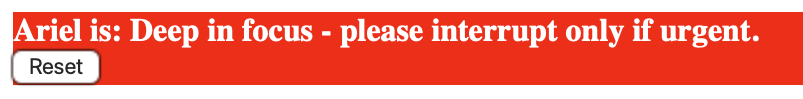
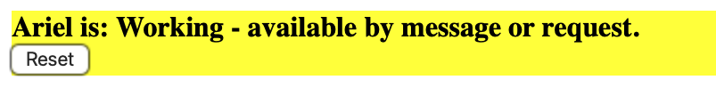
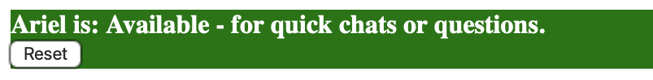

# WorkLight

**WorkLight** is a lightweight status indicator tool designed to support better communication in shared, hybrid, and remote work environments.

Originally created to simplify daily collaboration needs, **WorkLight** makes it easy for team members to quickly and clearly signal their availability — without interrupting workflows or needing complicated tools.

## Features

- Clear, color-coded status options (Focus, Working, Available)
- Single-click updates for fast, async-friendly communication
- Lightweight, no-login, mobile-friendly design
- Built with pure HTML, CSS, and vanilla JavaScript for maximum simplicity

## Preview

## Inspiration

**WorkLight** began as a way to reduce friction in day-to-day interactions, particularly for team members managing both focused deep work and collaborative demands.  

It applies principles of Agile communication, asynchronous collaboration, and respectful signaling to improve team flow — whether remote, hybrid, or onsite.

## Live Demo

[Try WorkLight here!](https://hellomynameisariel.github.io/worklight/)

## License

MIT License — free to use, modify, or improve.
